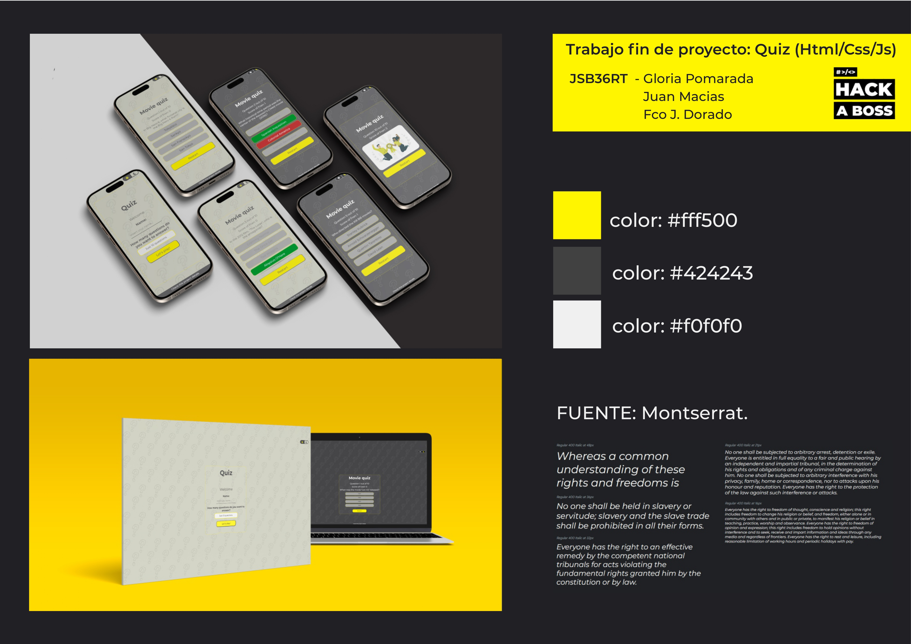

# App web de un quiz con HTML, CSS y JavaScript</h1>

## Índice

  1. [Sobre el proyecto ✒️](#about)
  2. [Construido con 🛠️](#built-with)
  3. [Características 📋](#features)
  4. [UI 📱](#ui)
  5. [Contribuir 🚀](#contributing)
  6. [Licencia 📄](#license)
  7. [Desarrolladores ✏️](#contact)

## Sobre el proyecto ✒️ 
Este juego de preguntas y respuestas es un proyecto desarrollado durante el bootcamp de programación web de <a href="https://www.hackaboss.com/">Hack a Boss</a>. A partir del JSON con preguntas y respuestas proporcionado se crea la app incluyendo una serie de requisitos básicos a los que se añaden funcionalidades extra para mejorar la experiencia del jugador.

## Construido con 🛠️ 
Esta app ha sido desarrollada con: 

 
 
 
 
 

## Características 📋 
- La app incluye una primera página en la que el usuario introduce su nombre y el número de preguntas que desea contestar. El botón de 'Let's play' ejecuta el submit y los datos enviados se almacenan en el navegador del usuario mediante localStorage. Esos datos se gestionan mediante funciones. 
- Los datos del JSON se procesan y transforman en un objeto JS mediante la función asíncrona loadQuestions. Mediante un set se almacena el número de preguntas selecionadas y se le aplica el método Math.random para que se muestren de forma aleatoria y además no se repitan.
- Mediante la función displayQuestions se gestiona que en la pantalla se muestren las sucesivas preguntas junto a la lista de respuestas, cada una dentro de un botón. Para ello se emplean los métodos de DOM y gestión de eventos. 
- La función checkAnswer verifica si la respuesta es correcta o incorrecta y pasa directamente a la siguiente pregunta aplicando un setTimeout.
- Una vez respondidas las preguntas, se gestiona el reinicio del juego mediante un evento y la función playAgain resetea tanto el quiz como las variables.

## UI 

- Diseño mobile first.
- Diseño responsive mediante media query. 
- Modo dark y light, con modificación de los colores de los elementos de la interfaz en cada uno de ellos.

## Contribuir 🚀 
Este es un proyecto de código abierto y las contribuciones son bienvenidas.

## Licencia 📄 

## Desarrolladores ✏️ 

